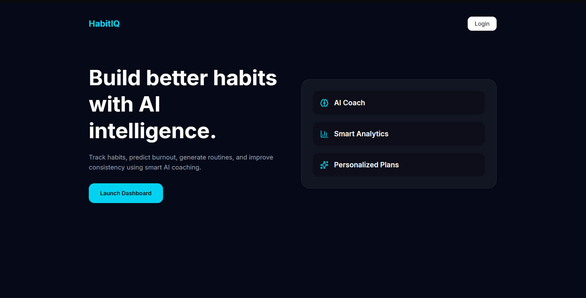
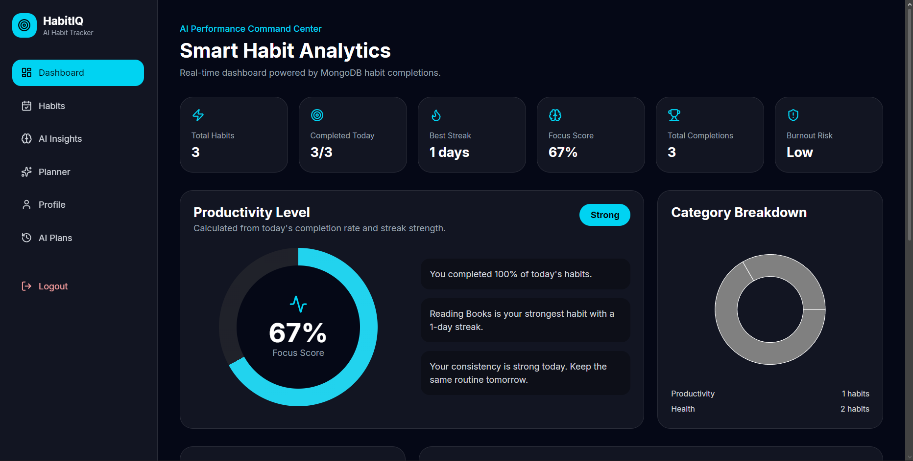
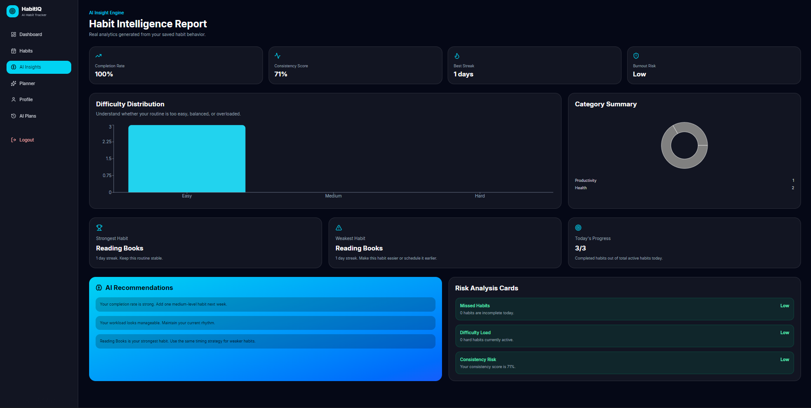
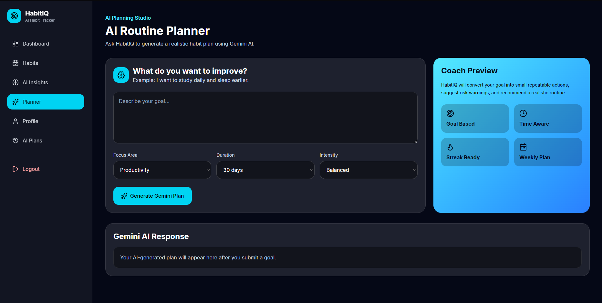
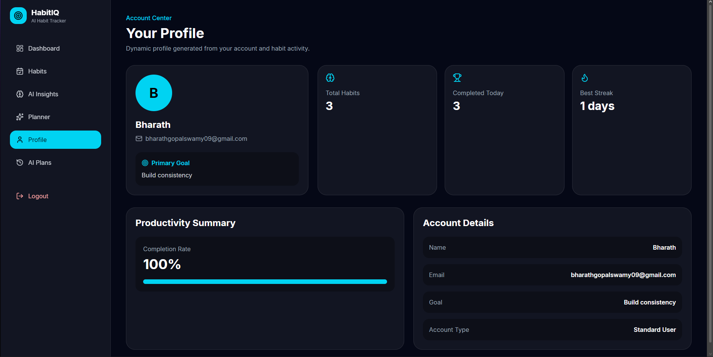
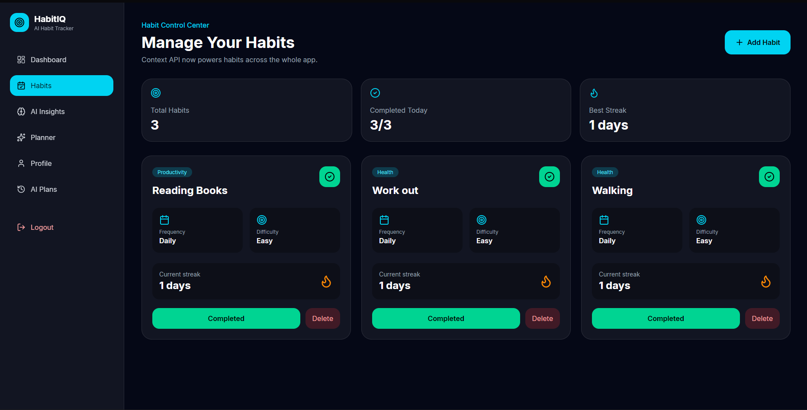
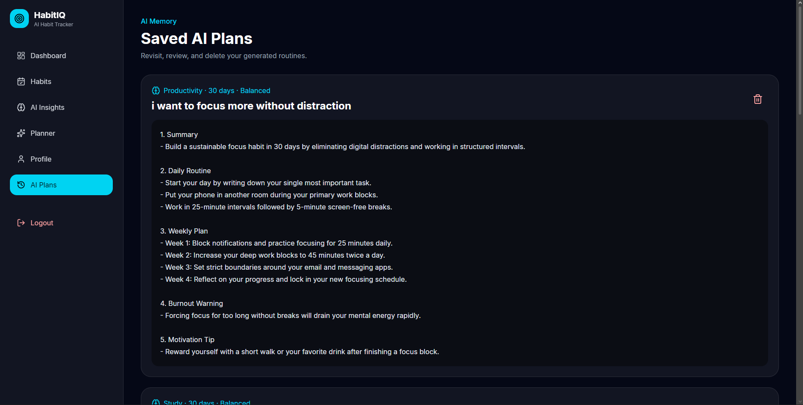

# HabitIQ — AI Powered Habit Tracker 🚀

> Build better habits with AI intelligence.

HabitIQ is a full-stack AI-powered habit tracking platform that helps users:

* Track daily habits
* Generate AI routines using Gemini AI
* Analyze productivity and burnout risk
* Monitor streaks and completion rates
* Store AI-generated plans permanently
* Visualize analytics with interactive dashboards.

---

# 🌟 Features

## ✅ Authentication System

* JWT Authentication
* Secure Login/Register
* Protected Routes
* MongoDB User Storage

## ✅ Smart Habit Tracking

* Add/Delete Habits
* Mark Daily Completion
* Real-Time Completion Tracking
* Persistent MongoDB Storage

## ✅ AI Routine Planner

* Gemini AI Integration
* Personalized Productivity Plans
* Fitness / Study / Focus Plans
* Burnout Warnings
* Motivation Tips
* Weekly Structured Routines

## ✅ AI Plans History

* Save Generated Plans
* Delete Old Plans
* Revisit Previous AI Sessions
* Dynamic AI Memory Page

## ✅ Smart Dashboard Analytics

* Focus Score
* Best Streak
* Burnout Risk Detection
* Productivity Insights
* Completion Percentage
* Dynamic Progress Tracking

## ✅ AI Insights Engine

* Consistency Score
* Category Distribution
* Risk Analysis Cards
* Strongest / Weakest Habit Detection
* AI Recommendations

---

# 🖥️ Tech Stack

## Frontend

* React
* TypeScript
* TailwindCSS
* Axios
* Recharts
* React Router
* Lucide Icons

## Backend

* Node.js
* Express.js
* MongoDB Atlas
* Mongoose
* JWT Authentication
* Gemini AI API

---

# 📸 Application Screenshots

## 🏠 Landing Page



---

## 📊 Smart Dashboard



---

## 🧠 AI Insights Engine



---

## 🤖 AI Planner



---

## 👤 Dynamic Profile Page



## Habits Page



---

## 💾 AI Plans Memory



---

# ⚙️ Installation Guide

## 1️⃣ Clone Repository

```bash
git clone https://github.com/YOUR_USERNAME/habitiq.git
cd habitiq
```

---

# 🚀 Backend Setup

## Navigate to server

```bash
cd server
```

## Install dependencies

```bash
npm install
```

## Create `.env`

```env
PORT=5000
MONGO_URI=YOUR_MONGODB_URI
JWT_SECRET=YOUR_SECRET
GEMINI_API_KEY=YOUR_GEMINI_API_KEY
```

## Start backend

```bash
npm run dev
```

---

# 🎨 Frontend Setup

## Navigate to client

```bash
cd client
```

## Install dependencies

```bash
npm install
```

## Start frontend

```bash
npm run dev
```

---

# 🌐 API Endpoints

## Authentication

| Method | Endpoint             |
| ------ | -------------------- |
| POST   | `/api/auth/register` |
| POST   | `/api/auth/login`    |

---

## Habits

| Method | Endpoint          |
| ------ | ----------------- |
| GET    | `/api/habits`     |
| POST   | `/api/habits`     |
| PUT    | `/api/habits/:id` |
| DELETE | `/api/habits/:id` |

---

## AI Planner

| Method | Endpoint       |
| ------ | -------------- |
| POST   | `/api/ai/plan` |

---

## AI Plans

| Method | Endpoint         |
| ------ | ---------------- |
| GET    | `/api/plans`     |
| DELETE | `/api/plans/:id` |

---

# 📈 Advanced Features

## Smart Analytics

* AI productivity scoring
* Burnout detection
* Consistency analysis
* Habit intelligence reports

## AI Coaching

* Daily improvement recommendations
* Personalized routines
* Weekly planning systems
* Motivation analysis

---

# 🔐 Environment Variables

## Server `.env`

```env
PORT=5000
MONGO_URI=
JWT_SECRET=
GEMINI_API_KEY=
```

---

# 🧠 Future Improvements

* Email reminders
* Browser notifications
* AI voice coach
* Mobile app version
* Team productivity mode
* AI-generated workout schedules
* Calendar integrations

---

# 🏆 Resume Highlights

This project demonstrates:

* Full Stack Development
* AI Integration
* Authentication Systems
* REST APIs
* MongoDB Database Design
* Dashboard Analytics
* Data Visualization
* Real-Time State Management
* Modern UI/UX Engineering

---

# 👨‍💻 Author

## Bharath Gopalsamy

* LinkedIn: https://www.linkedin.com/in/bharath-gopalswamy
* GitHub: https://github.com/bharathgopalswamy09

---

# ⭐ If you like this project

Give it a ⭐ on GitHub and support the project.
